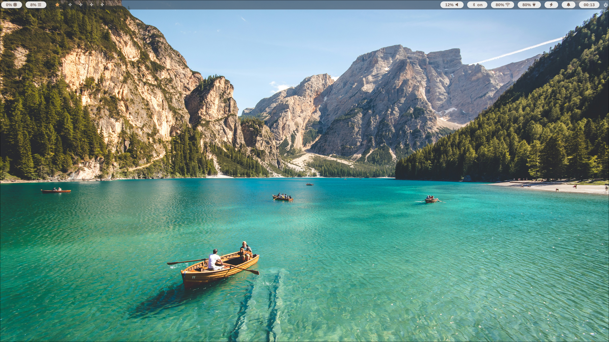

# Kobekeye's dotfiles
These are my dotfiles which runs on:
- Arch Linux as Linux distribution
- both Sway and Hyprland(Sway when I prefer stability, Hyprland when I have a lot of time.)
- Neovim as the text editor(I'm actually thinking whether to switch to helix)
- Kitty as the shell
